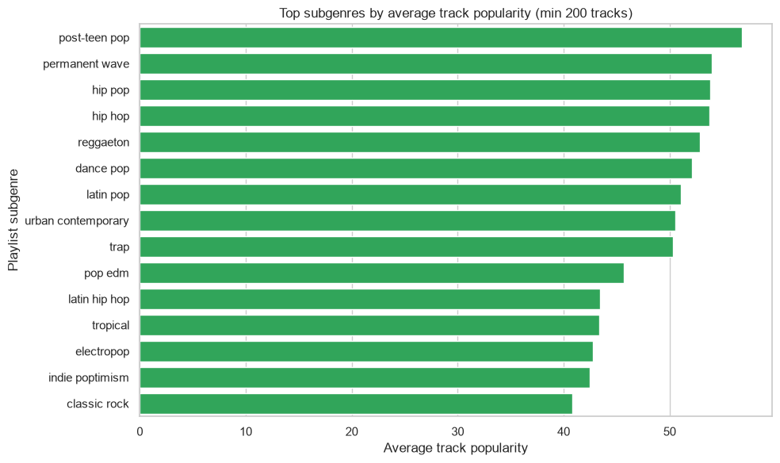
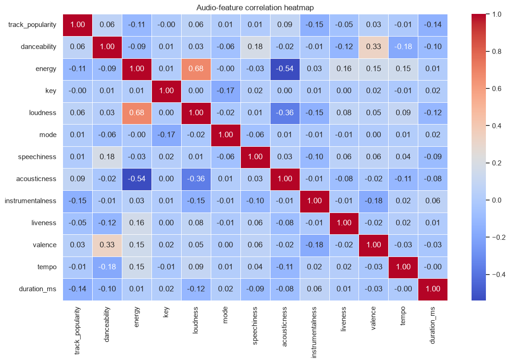
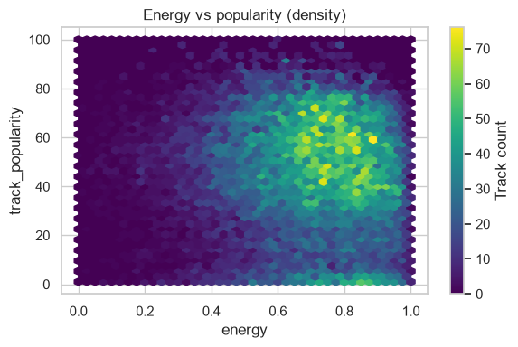
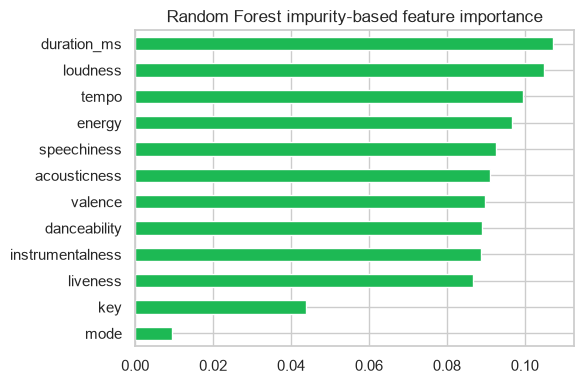
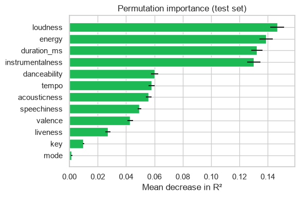

# Spotify Track Popularity — EDA & Prediction

Can a track's **audio features alone** predict how popular it will be? This project runs a full
exploratory analysis of ~32,000 Spotify tracks and compares regression models — and the honest
answer is *only partly*, which turns out to be the most interesting finding.

## Why I built this

I wanted an end-to-end data-science project — EDA, feature analysis, model comparison, and
interpretation — on a dataset where the honest result is a **limitation**, not a headline number.
Reporting a real ~0.30 R² ceiling and explaining *why* is more valuable (and more truthful) than
overfitting to a bigger number.

## Overview

Exploratory analysis of artists, genres and audio features, followed by a model comparison
(linear → tree ensembles → gradient boosting → XGBoost) predicting `track_popularity` from 12
audio features, with impurity- and permutation-based feature importance.

## Dataset

- **~32,000 tracks** from the *30,000 Spotify Songs* dataset (TidyTuesday 2020-01-21, via the
  `spotifyr` package; Kaggle mirror by Joakim Arvidsson).
- Target: **`track_popularity`** (0-100).
- Not committed — see [`data/README.md`](data/README.md); the original dataset documentation and
  data dictionary are preserved in `data/dataset_readme.md`.

## Methodology

1. **EDA** — distributions and summary statistics of audio features.
2. **Artist analysis** — a **Bayesian weighted average** to rank artists fairly despite small
   per-artist sample sizes.
3. **Genre/subgenre analysis** — average popularity by subgenre.
4. **Feature relationships** — correlation heatmap and energy-vs-popularity density.
5. **Modelling** — compare 5 regressors on a held-out 20% test set (MAE, RMSE, R²).
6. **Interpretation** — impurity-based and permutation feature importance.

## Key results (verified from the executed notebook)

**Model comparison** (test set, target 0-100):

| Model | MAE | RMSE | R² |
|---|---|---|---|
| **Random Forest** | **16.33** | **20.82** | **0.302** |
| XGBoost | 18.32 | 22.13 | 0.211 |
| Gradient Boosting | 19.47 | 23.39 | 0.119 |
| Linear Regression | 20.09 | 24.02 | 0.071 |
| Ridge | 20.09 | 24.02 | 0.071 |

- **Random Forest is best (R² ≈ 0.30).** Linear models capture almost nothing (R² ≈ 0.07), so
  what predictive signal exists is **non-linear**.
- **Most informative features** (permutation importance on the test set): **loudness, energy,
  duration, instrumentalness** — consistent with the impurity-based ranking.
- **No single audio feature correlates strongly with popularity** — the correlation heatmap makes
  the modelling ceiling visible before any model is trained.

## Figures

| Top subgenres by popularity | Feature correlation heatmap |
|---|---|
|  |  |

| Energy vs popularity (density) | Random Forest feature importance | Permutation importance |
|---|---|---|
|  |  |  |

## The honest finding

Even the best model explains only **~30% of the variance** in popularity. That is the real
result: Spotify popularity is driven heavily by factors **absent from this dataset** — marketing,
playlist placement, release timing, and artist fame. Audio features alone therefore have a
natural predictive ceiling, and pretending otherwise would mean overfitting. Recognising and
explaining that ceiling is the point.

## Tools & technologies

`Python` · `pandas` · `numpy` · `scikit-learn` (RandomForest, GradientBoosting, LinearRegression,
Ridge, permutation_importance) · `XGBoost` · `seaborn` / `matplotlib` · `Jupyter`

## What I learned

- A weak/non-linear relationship shows up clearly in the gap between linear (0.07) and
  tree-ensemble (0.30) R².
- Permutation importance is a more trustworthy read on feature value than impurity importance.
- Bayesian shrinkage fixes the "one-hit-wonder tops the chart" problem in small-sample rankings.

## Limitations

- Audio-feature ceiling (~0.30 R²) as described above.
- `track_popularity` is a time-varying snapshot.
- Only light manual hyperparameter choices; no exhaustive search.

## Reproduction

```bash
pip install -r requirements.txt
# place spotify_songs.csv in data/ (see data/README.md)
jupyter notebook notebook/spotify-popularity-prediction.ipynb
```

## Licence

MIT — see [LICENSE](LICENSE). Dataset attribution in `data/dataset_readme.md`.
